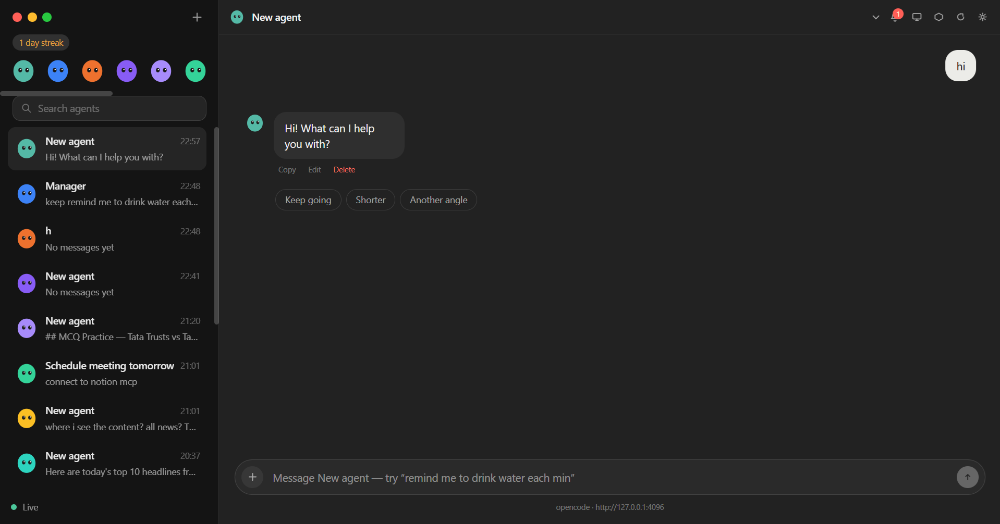
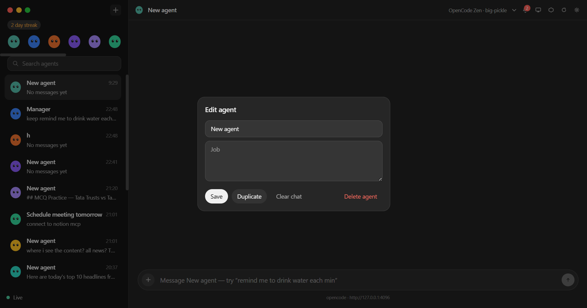
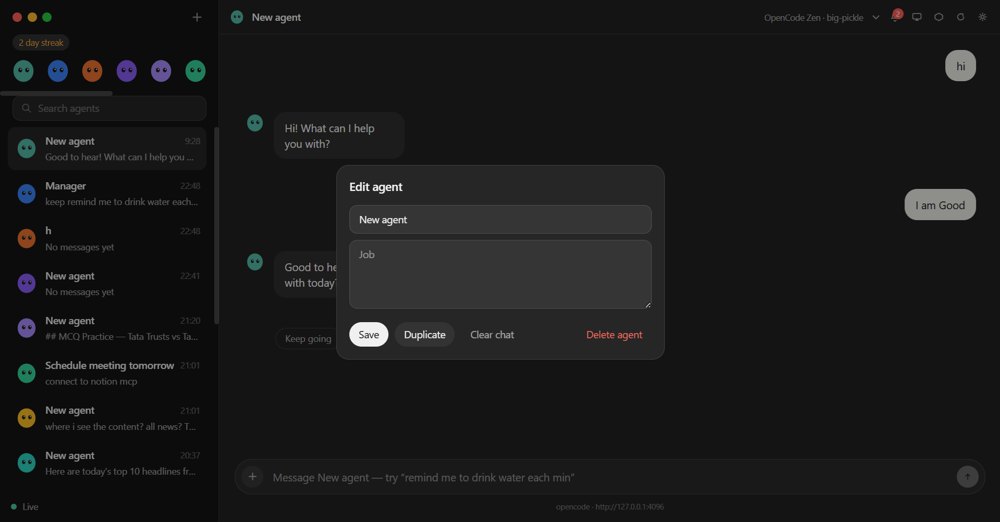
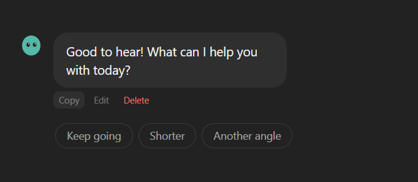
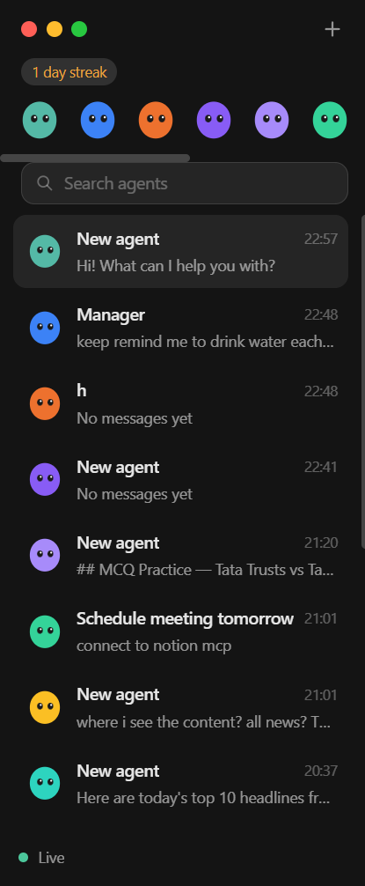
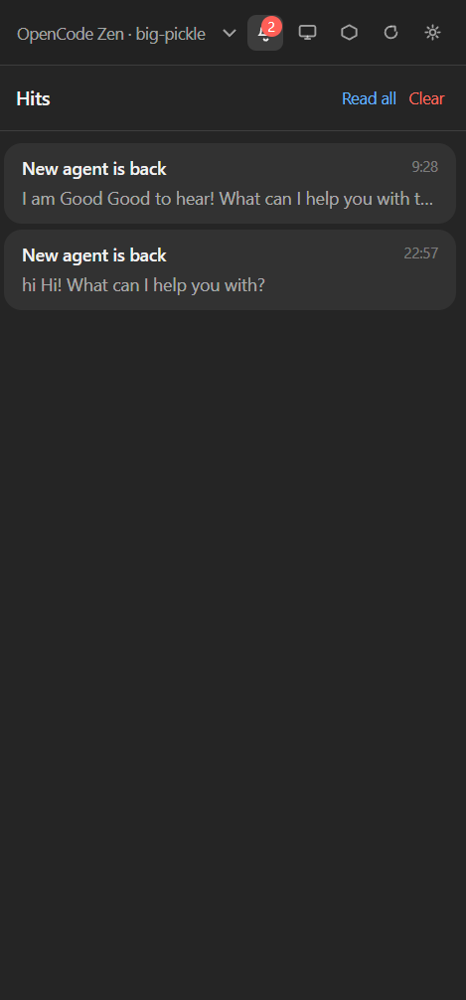
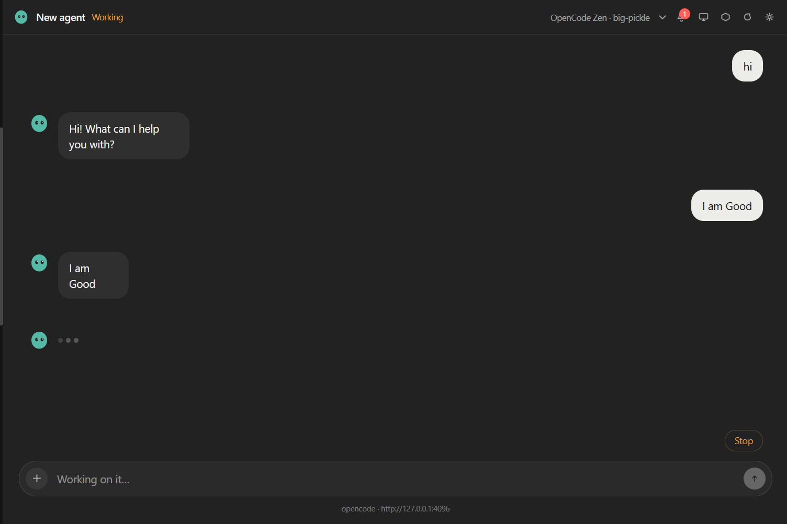

# Red Sky

Red Sky is a Grok Bot–style desktop app that runs local AI teammates on your machine. Each agent ("bot") gets its own OpenCode session, workspace, memory, and schedule — you spin up teammates for Sales Outbound, Talent Scout, Paid Media, Bug Reproduction, Chief of Staff, and more, and they work inside a sandboxed workspace and check back when they need a human.

The runtime is **OpenCode** running locally on this machine — **not Ollama**.

## Screenshots



*The dashboard: your bots in the left nav, the selected bot's chat and live activity trail on the right.*

| Create a new agent | Edit an agent |
| --- | --- |
|  |  |
| Give a bot a name, a job, and a model — or start from a template. | Rename, re-prompt, change the model, or delete a bot. |

| Chat actions | Left nav bar |
| --- | --- |
|  |  |
| Per-message actions — edit, copy, delete, and branch the conversation. | Switch between bots, rooms, and scheduled routines. |

| Notification bar | Processing a task |
| --- | --- |
|  |  |
| Desktop notifications when a bot finishes or needs a human. | A bot streaming its work — tools run, files touched, shell commands. |

## Features

- **Multi-agent chat** — create, rename, duplicate, and delete bots; watch their replies stream in live.
- **Job templates** — one-click bots preconfigured for recurring work (sales, recruiting, campaigns, expenses, product reads, bug repro, account health, chief of staff).
- **Live activity feed** — each bot shows a "computer" trail of tools run, files touched, and shell commands.
- **Artifacts & workspace diff** — every run lists files added/changed/removed, with clickable artifacts and a file browser.
- **Memory** — bots learn durable facts ("Noted for next time: …") and recall them across sessions.
- **Schedules & routines** — cron-style routines and natural-language reminders ("remind me to … at 9am"), with desktop notifications.
- **Teach a routine** — after a bot does a task, turn that task into a recurring schedule.
- **Bot handoff** — bots pass work to other bots with `@Name` mentions in group rooms.
- **Auto Review** — holds destructive/expensive/sending work for human approval before it runs (always / sensitive / off).
- **Privacy mode** — on by default; keeps secrets and personal data out of logs and outbound drafts.
- **Connectors** — a manual status board to track which external tools a bot has access to.
- **Search** — across agents, messages, memories, and workspace files.

## Requirements

- **Node.js 20+** (with npm)
- **OpenCode CLI** on your `PATH` — install from https://opencode.ai. This app does **not** use Ollama.
- **A configured OpenCode model provider** (e.g. an Anthropic, OpenAI, or Google key in your OpenCode auth config). Select the model per bot in the UI.

> OpenCode is a separate CLI, not the same `npm i opencode` you'd run inside this repo. Install it globally per the OpenCode docs and confirm it works:
>
> ```powershell
> opencode --version
> ```

## One-click setup (Windows/macOS/Linux)

```bash
# 1. clone
git clone https://github.com/0xMudit/RedSky-Bot.git
cd RedSky-Bot

# 2. install dependencies
npm install

# 3. run (builds main + preload + renderer, then launches Electron)
npm start
```

OpenCode boots automatically inside the app, scoped to Red Sky's workspace. When the status bar shows **online · opencode**, create a bot and send it a task.

### First-run checklist

1. `opencode --version` works in a terminal.
2. OpenCode has a model provider configured (`opencode auth` / run `opencode` once and pick a provider + model).
3. `npm start` → app opens, status turns **online**.
4. Create a bot (or use a template), type a task, watch it stream back.

## Environment variables

| Variable | Purpose |
| --- | --- |
| `OPENCODE_BIN` | Path to the `opencode` binary/cmd, if not on PATH. |
| `OPENCODE_SERVER_PASSWORD` | Basic-auth password for the OpenCode server (with optional `OPENCODE_SERVER_USERNAME`). |
| `REDSKY_OPCODE_URL` / `OPENCODE_SERVER_URL` | Attach to an already-running OpenCode server instead of spawning one. |

## Scripts

| Command | Description |
| --- | --- |
| `npm start` | Build (esbuild for main/preload, Vite for renderer) and launch Electron. |
| `npm run dev` | Same as `npm start`. |
| `npm run build` | Build main + preload + renderer into `dist/` without launching. |
| `npm run typecheck` | Type-check the codebase with `tsc --noEmit`. |

## Data locations

Everything lives under Electron's userData dir and is **not** wiped between runs:

| Path | Contents |
| --- | --- |
| `userData/workspace` | Sandboxed working directory where agents create/edit files. |
| `userData/workspace/logs` | Per-run tool and transcript logs, server info files. |
| `userData/settings.json` | App settings (applied on "Save" only). |

On Windows the userData dir is `%APPDATA%\red-sky`. Use **Open Workspace** / **Open Logs** in the app to jump there directly.

## Architecture

```
renderer/  React 19 + Tailwind 4 UI (Vite)
electron/  Electron main process + OpenCode integration
shared/    Types shared between main and renderer
```

| Module | Role |
| --- | --- |
| `electron/server.ts` | Spawns/attaches the OpenCode server, streams SSE events, resolves the binary. |
| `electron/agent.ts` | Bot lifecycle, session management, thread streaming, permission handling, run diffs. |
| `electron/main.ts` | Window + IPC surface; every `rs:*` handler the renderer calls. |
| `electron/settings.ts` | Settings store (privacy, auto-review, handoff, parallelism). |
| `electron/scheduler.ts` | Cron routines + reminders, desktop notifications. |
| `electron/memory.ts` | Durable bot memory harvested from replies. |
| `electron/workspace.ts` | Workspace snapshots and diffs for artifact tracking. |
| `electron/tools.ts` | Extra tools exposed to the renderer over IPC. |

Agents talk to the local OpenCode server over HTTP + SSE (`/session`, `/prompt_async`, `/event`, permissions). Every run is sandboxed to the Red Sky workspace.

## Troubleshooting

| Symptom | Fix |
| --- | --- |
| Status stuck on **starting**, times out after 45s | `opencode` not on PATH. Install from https://opencode.ai and restart. It is **not** Ollama. |
| **offline · opencode exited** | OpenCode server crashed on launch. See `userData/workspace/logs` for the server info, then open an issue. |
| "OpenCode did not return a session id" | The server started but didn't answer `/session`. Check the provider is authenticated (`opencode auth`). |
| No models in the model picker | No provider connected, or only Ollama is configured — Ollama is deliberately excluded. |
| Permissions stream halts | A bot is waiting — approve **once / always** or reject in the chat. |
| Build errors after pulling | Re-run `npm install`, then `npm run typecheck`. |

## License

Private repository — © Muditya Raghav (`0xMudit`). All rights reserved.